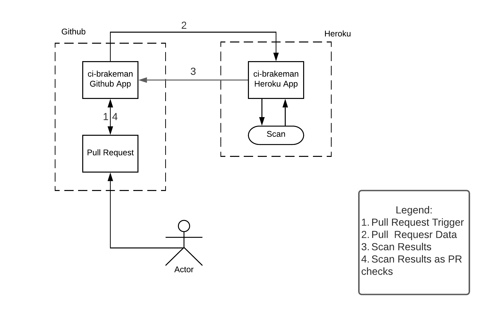

# CI-Brakeman
This repository contains `brakeman`, a popular tool for scanning Ruby on Rails. The core tool is developed in [presidentbeef/brakeman](https://github.com/presidentbeef/brakeman), this repository contains information on its use in the CI/CD context. The following two subsections describe setup and development for monitoring the GitHub Org. 

# Architecture

## Components of CI-Brakeman

### Github app:
A github app is a webhook at an organization level, capturing to all the 'pull request' events. Once a PR is created, the Github app sends the information about the PR to the Heroku backend over a webhook. Git app has a client id, client secret, app id and install id, which are required parameters for the backend to function. The app also has a private key which is needed to access the private repositories in Github. Please store this key at a safe location and do not lose it as it cannot be retrieved again. 

### Heroku App (Backend): 
The backend is the heart of the CI-Brakeman. It connects to Github using the Github app and listens to an event from the Git webhook. The backend scans an event from the webhook using Brakeman. The scan details are logged.The scan details are then sent back to the Github app and are added to the PR as PR checks. It **DOES NOT** block the PR yet.

## Setup
The setup involves two major steps:
- Configuring the Heroku Instance
- Creating and Installing a Github App

### Configuring the Heroku Instance
- Sign up for a free account on Heroku (if you haven't already) [here](https://signup.heroku.com/). 
- Install the [Heroku CLI](https://devcenter.heroku.com/articles/heroku-cli)

#### Setting up the Heroku App
- Go to [https://dashboard.heroku.com/](https://dashboard.heroku.com/) and click on `New->Create New App`
- Enter the app name and click `Create App`

- With that, configure the following config vars in the `Settings` section (some of these config vars can be set only after following the next step of configuring Github App):
    * `ENVIRON` - Environment identifier for logging and pipelines
    * `GITHUB_APPID` - ID of the installed Github App
    * `GITHUB_INSTALLID` - Installation ID of the GitHub App, can be extracted from the URL when accessing app's configuration
    * `GITHUB_PRIVATE_KEY` - Created while creating the app
    * `GITHUB_SECRET` - secret that ci-brakeman requires from the GitHub App, to be configured in the app as client secret as well

#### Heroku Buildpacks
Select the following buildpacks in the `Settings` section:
- `heroku/ruby`
- `heroku/go`

#### Logging in through command line
After you install the CLI, run the `heroku login` command. You’ll be prompted to enter any key to go to your web browser to complete login. The CLI will then log you in automatically.

#### Deploying to Heroku with Git
- Clone this (CI-Brakeman) Git repository.
- Follow [these](https://devcenter.heroku.com/articles/git#creating-a-heroku-remote) guidelines for deploying the app to your Heroku instance.

#### Logging
Once the app is deployed to Heroku, you can view the logs by going to the app on the Heroku Dashboard and clicking `More->View Logs`

### Creating and Installing a Github App
- Follow [this](https://docs.github.com/en/developers/apps/building-github-apps/creating-a-github-app) guide by Github to create an app and add the following information

#### General 
- Use a suitable Github App name. 
- The Homepage URL, Callback URL and Webhook URL will be the URL for your Heroku app (found in the Settings -> Domains section of the Heroku app)
- Enable SSL verification. Disabling SSL verification has some risks so consider them before choosing the 'Disable' option. 
- Click on 'Generate a Private Key'. Copy the key and save it in a secrets manager or at a safe location. In case of loss of this key, generate a new one from the app settings and update it in Heroku config vars.

#### Permissions and Events
Here are the specific permissions needed for CI-Brakeman to function. You can add more permissions, if needed.
- Contents: Read and write
- Webhooks: Read and write
- Checks: Read-only
- Pull requests: Read-only
- Projects: Read-only

Rest of the permissions are set to 'No Access'.Also, no changes are made to the User Permissions

#### Install App
Choose the Github org or the user you would like to installed the app into. You can install the app for the whole org or select the specific repositories.

## Running and Testing the whole flow
Once the above steps are completed, create a Pull Request and CI-Brakeman will attach the results as a PR check. 

## Brakeman Warning Types
To learn more about warning types in Brakeman, please refer [this](https://brakemanscanner.org/docs/warning_types/).

## How to ignore the false positives?
The findings that need to be ignored in the future scans can be added to the `breakman.ignore` file in the `config` directory in the ruby repository. 
This is a standard practice for brakeman and more information can be found [here](https://brakemanscanner.org/docs/ignoring_false_positives/)

